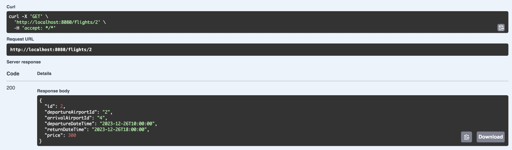
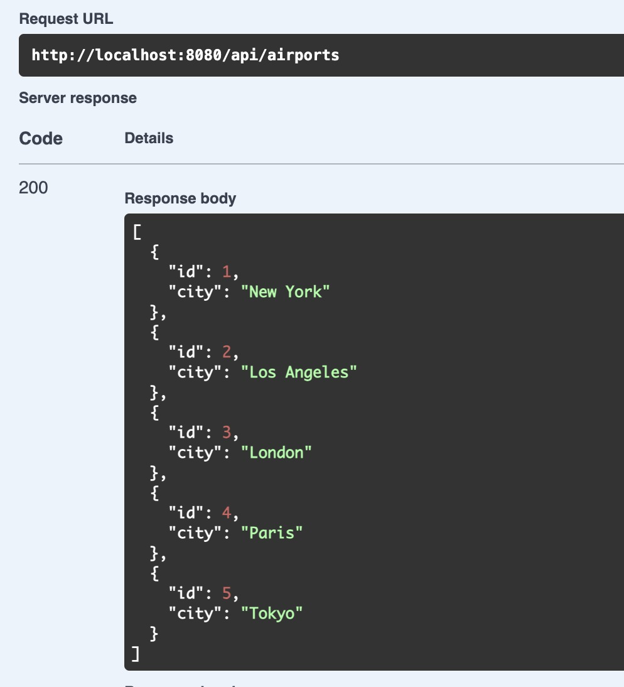

# Flight Search API

FlightSearchAPI is a Spring Boot application that provides an API for managing flight information.

## Table of Contents

- [Introduction](#introduction)
- [Features](#features)
- [Technologies Used](#technologies-used)
- [Setup](#setup)
- [Usage](#usage)
- [Endpoints](#endpoints)


## Introduction

FlightSearchAPI is designed to handle various operations related to flights, including CRUD functionalities (Create, Read, Update, Delete) and searching for flights based on different criteria such as departure airport, arrival airport, and date/time.

## Features

- **CRUD Operations:** Perform basic CRUD operations on flight entities.
- **Flight Search:** Search for flights based on departure airport, arrival airport, and date/time criteria.
- **API Endpoints:** Provides RESTful API endpoints for interacting with flight data.

## Technologies Used

- Java
- Spring Boot
- Spring Data JPA
- PostgreSQL 
- Swagger
- OAuth2

## Setup

1. **Clone the Repository:**

   ```bash
   git clone https://github.com/berkinozturk/FlightSearchAPI.git


2. **Database Configuration:**

Configure your database settings in the application.properties file.

3. **Build and Run:**

Build the project using Maven build tool.
Run the application using your IDE or by executing the generated JAR file.

<h2>After Logging In with Google Account</h2>

<p>Once logged in with your Google account, you have two options to interact with the FlightSearchAPI:</p>

<h3>Option 1: Localhost Redirect</h3>

<p>After successful login:</p>
<ol>
  <li>The application will redirect you to <code>http://localhost:&lt;port&gt;</code> (replace <code>&lt;port&gt;</code> with your application's port number).</li>
  <li>You can access the application's functionalities through the provided API endpoints.</li>
  <li>Refer to the documentation or API specifications for details on available endpoints.</li>
</ol>

<h3>Option 2: Swagger UI</h3>

<p>Alternatively, you can access the Swagger UI to interact with the API endpoints:</p>
<ol>
  <li>Open your browser and navigate to <code>http://localhost:&lt;port&gt;/swagger-ui.html</code> (replace <code>&lt;port&gt;</code> with your application's port number).</li>
  <li>This will open the Swagger UI interface, allowing you to explore and test the available endpoints interactively.</li>
  <li>Use the Swagger UI to execute requests, view responses, and understand the API's capabilities.</li>
</ol>

<p>Choose the option that best suits your needs to interact with the FlightSearchAPI after logging in with your Google account.</p>


<h2>Configuring PostgreSQL and Port Information</h2>

<p>In order to connect and run the FlightSearchAPI successfully, ensure that you have configured the PostgreSQL database settings and specified the port information in the <code>application.properties</code> file.</p>

<h3>PostgreSQL Configuration</h3>

<p>Edit the <code>application.properties</code> file and provide the necessary PostgreSQL connection details:</p>

<pre><code>
spring.datasource.url=jdbc:postgresql://localhost:5432/postgres
spring.datasource.username=postgres
spring.datasource.password=1234
</code></pre>

<h3>Port Information</h3>

<p>Specify the port information for running the FlightSearchAPI:</p>

<pre><code>
server.port=your_desired_port_number
</code></pre>

<p>Replace <code>your_desired_port_number</code> with the port number you want to use for running the FlightSearchAPI locally (e.g., 8080, 9090, etc.).</p>

<p>Save the changes made to the <code>application.properties</code> file to ensure proper database connectivity and application execution.</p>


## Usage

<p>Once the application is up and running, you can interact with it using the provided API endpoints. Here are some examples:</p>

<ul>
  <li>Retrieve all flights: <code>GET /flights</code></li>
  <li>Retrieve a specific flight by ID: <code>GET /flights/{id}</code></li>
  <li>Create a new flight: <code>POST /flights</code></li>
  <li>Update an existing flight: <code>PUT /flights/{id}</code></li>
  <li>Delete a flight: <code>DELETE /flights/{id}</code></li>
  <li>Search for flights based on criteria: <code>GET /flights/search</code></li>
</ul>

## Endpoints

<table>
  <tr>
    <th>Endpoint</th>
    <th>Description</th>
    <th>Request Type</th>
  </tr>
  <tr>
    <td><code>GET /flights</code></td>
    <td>Retrieve all flights</td>
    <td>GET</td>
  </tr>
  <tr>
    <td><code>GET /flights/{id}</code></td>
    <td>Retrieve a specific flight by ID</td>
    <td>GET</td>
  </tr>
  <tr>
    <td><code>POST /flights</code></td>
    <td>Create a new flight</td>
    <td>POST</td>
  </tr>
  <tr>
    <td><code>PUT /flights/{id}</code></td>
    <td>Update an existing flight</td>
    <td>PUT</td>
  </tr>
  <tr>
    <td><code>DELETE /flights/{id}</code></td>
    <td>Delete a flight</td>
    <td>DELETE</td>
  </tr>
  <tr>
    <td><code>GET /flights/search</code></td>
    <td>Search for flights based on criteria</td>
    <td>GET</td>
  </tr>
</table>


## Sample Images



